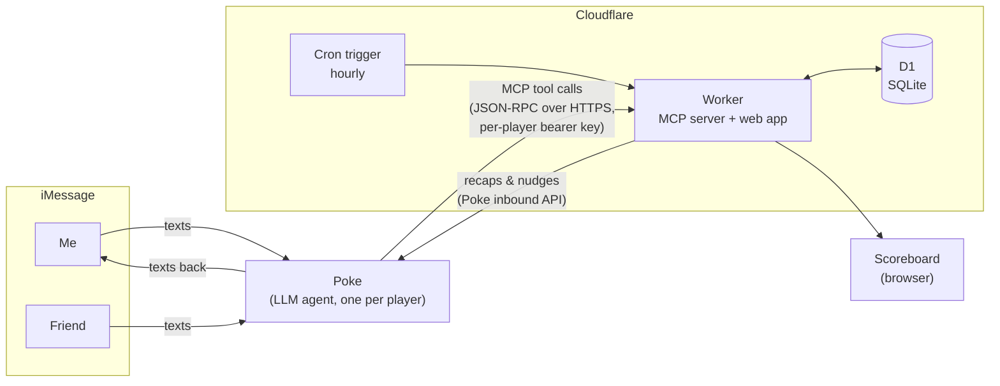

# Health Bet

**A health bet between two friends that you play over iMessage.** You text your AI agent what you ate, when you went to bed, and when you woke up. It estimates calories and macros, logs everything to this app over the [Model Context Protocol](https://modelcontextprotocol.io), and keeps score. Lowest score each week does the punishment.

No calorie-counting app, no forms, no barcode scanning. Just texts like these:

> **me:** greek yogurt with ¼ cup pb protein granola, pomegranate and blueberries
> **Poke:** Logged ~365 cal, 31g protein. You're at 1,120 / 1,700 cal and 88 / 120g protein. 32g to go.
> **me:** gn
> **Poke:** Bedtime logged at 12:40am.
> **me:** up
> **Poke:** 7h 25m. Sleep point ✓ and up by 8:30 ✓.

Built for my friend and me: I'm cutting, he's bulking, and we both want more sleep.

---

## How it works



1. **Your agent is the interface.** Each player connects their own [Poke](https://poke.com) agent to the app as a custom MCP integration. Poke does the language understanding and the nutrition estimates. The app never runs its own model, so there's no AI bill on the server side.
2. **The app is an MCP server.** It exposes typed tools (`log_food`, `sleep_end`, `get_status`, …) over Streamable HTTP. Every request carries the player's own bearer key, so the server always knows who is logging and never takes a "who is this?" argument from the model.
3. **The server enforces the rules, not the model.** Scoring, day boundaries, deadlines, and privacy all live in deterministic TypeScript. The agent gets back plain-text results with running totals, so it can't drift from what's stored.
4. **It talks back.** An hourly cron sends a 10am recap, a 9pm "here's what's left" check-in, and the Monday verdict through Poke's inbound API, so the reminders arrive as normal iMessages.

## The rules

Each day, each player can earn up to **4 points**:

| | Cut | Bulk |
|---|---|---|
| 🔥 Calories | at or under target (never under a 1,200 floor) | at or over target |
| 💪 Protein | at or over target | at or over target |
| 😴 Sleep | 7h or more | 7h or more |
| ⏰ Wake-up | up by 8:30 weekdays, 10:30 weekends (10 min grace) | same |

- Fat and carbs are tracked and shown but not scored.
- Logging nothing doesn't count as a perfect cut day.
- Weeks run Monday to Sunday. The lowest total loses. Ties go to whoever slept more.
- Days roll over at **4am**, so a 1am snack counts for the night before. Sleep counts toward the day you wake up.
- Scoring starts on the bet's start day (`start_day` in the settings table), so days logged before both players joined don't count.

## Privacy by design

Friendly competition, not surveillance. The other player sees only what the bet needs:

| | Shared scoreboard | Your private page |
|---|---|---|
| Points and standings | ✓ | ✓ |
| Calorie and protein totals | ✓ | ✓ |
| Sleep and wake-up times | ✓ | ✓ |
| Meals | only ones you choose to share | ✓ all |
| Fat and carbs | – | ✓ |
| Weight | – | ✓ |

This is enforced on the server. When your friend's agent asks for status, the response simply doesn't contain your private fields, so there's nothing for a model to leak. Meals are private by default and shared one at a time (or a whole day) from your page or by texting "share my dinner".

## MCP tools

| Tool | What it does |
|---|---|
| `log_food` | Log items with calories, protein, fat and carbs; add to an existing meal or backdate up to a week |
| `edit_food` / `delete_food` | Fix or remove a single item ("actually it was 3 eggs") |
| `share_meal` | Share or unshare a meal, or a whole day, with the other player |
| `sleep_start` / `sleep_end` | "gn" and "gm"; computes duration and the wake-up point |
| `log_sleep` | A whole night after the fact ("slept 1 to 8") |
| `get_status` | Current time, goals, today's meals with ids, the other player's shared stats, the week's standings |
| `set_goal` / `log_weight` / `set_punishment` | Goals, private weigh-ins, and the stakes |

The server also sends the agent instructions on connect: log first and ask at most one clarifying question when a guess could be off by 150+ calories, treat any phrasing of "going to bed" or "woke up" as sleep, and never reveal the other player's private data.

## Engineering notes

Some details that took more than one try:

- **Agents and time zones.** LLMs often send ISO timestamps without an offset, or today's date in UTC (already tomorrow in California at 9pm). Offset-less times are read as wall-clock time in the game's time zone, including across DST changes. Future dates are clamped to the current game day instead of rejecting a meal.
- **A 4am game day.** Food uses a "game day" that rolls over at 4am. Sleep belongs to the calendar day you wake up. Both are pure functions with unit tests.
- **Exactly-once scheduled messages.** The hourly cron dedupes on keys like `recap:2026-09-30`, so a retried or overlapping run never double-texts anyone.
- **One-time secrets.** Your personal key is shown once. The join form uses post/redirect/get with a short-lived HttpOnly cookie, so refreshing can't silently rotate your key. Keys are stored as SHA-256 hashes.
- **Remembered devices.** The scoreboard sits behind a shared password and "My page" behind your personal key. Each is entered once per phone and remembered with a year-long HttpOnly cookie.
- **A hand-rolled MCP server.** Stateless Streamable HTTP with JSON-RPC 2.0, batch support, notifications, and protocol-version negotiation in under 400 lines, with no SDK. The whole worker, icons included, is about 50 KB gzipped.
- **No frontend framework.** Pages are server-rendered HTML. The charts (calories, protein, fat, sleep, wake-up, weight) are about 100 lines of hand-written SVG with crosshair tooltips, keyboard navigation, and a table view.
- **A colorblind-checked palette.** The pink and green player colors were validated for lightness, chroma, contrast, and color-vision-deficiency separation in both light and dark mode. Status colors never reuse a player's hue, so a ✓ can't be mistaken for "the green player".

## Stack

- **Runtime:** Cloudflare Workers (TypeScript), D1 (SQLite), and Cron Triggers, all on the free tier
- **Agent:** [Poke](https://poke.com) over MCP, plus Poke's inbound API for outgoing texts
- **Frontend:** server-rendered HTML/CSS, inline SVG charts, the Rubik font, light and dark mode, installable to the home screen
- **Tests:** Vitest for scoring rules, day boundaries, time parsing, and privacy filtering

```
src/
  index.ts     routes, join flow, password gate, scheduled messages
  mcp.ts       MCP server: JSON-RPC handling, tools, agent instructions
  game.ts      sleep logging, reports, status text (with the privacy filter)
  scoring.ts   the scoring rules as pure functions
  time.ts      time zones, 4am rollover, ISO parsing
  web.ts       scoreboard, history charts, private page, onboarding
  poke.ts      outgoing messages via Poke
  db.ts        D1 queries
migrations/    schema
test/          unit tests
```

## Run your own

You need a free Cloudflare account and a [Poke](https://poke.com) account for each player.

1. **Deploy:** in Cloudflare, go to **Workers & Pages → Create → Import a repository**, pick your fork, set the deploy command to `npm run deploy`, and deploy.
2. **Create the tables:** paste `migrations/0001_init.sql` into the D1 console (or run `npm run db:migrate`).
3. **Set a join code:** add `JOIN_CODE` as a runtime Secret, or insert it into the database with `INSERT INTO settings (key, value) VALUES ('join_code', '…')`.
4. **Join:** each player opens `/join` and picks a color. They get a personal key and add the app in Poke as a custom integration (MCP URL `https://<your-worker>/mcp`, API key = their personal key).
5. **Start texting:** "set my goal: cut, 1700 cal, 120g protein".

Tune the rules in `wrangler.toml`:

| Setting | Default | What it does |
|---|---|---|
| `GAME_TZ` | `America/Los_Angeles` | the time zone the game runs on |
| `SLEEP_TARGET_HOURS` | `7` | hours needed for the sleep point |
| `WAKE_WEEKDAY` / `WAKE_WEEKEND` | `08:30` / `10:30` | the wake-up deadline |
| `WAKE_GRACE_MINUTES` | `10` | minutes of grace on the wake-up deadline |
| `CUT_FLOOR_CALORIES` | `1200` | a cut day under this never earns the calorie point |

### Local development

```sh
npm install
npm test
cp .dev.vars.example .dev.vars
npx wrangler d1 migrations apply health-bet --local
npm run dev    # http://localhost:8787/join
```

---

Built by [Dara Miao](https://github.com/dara-miao), with [Claude Code](https://claude.com/claude-code).
